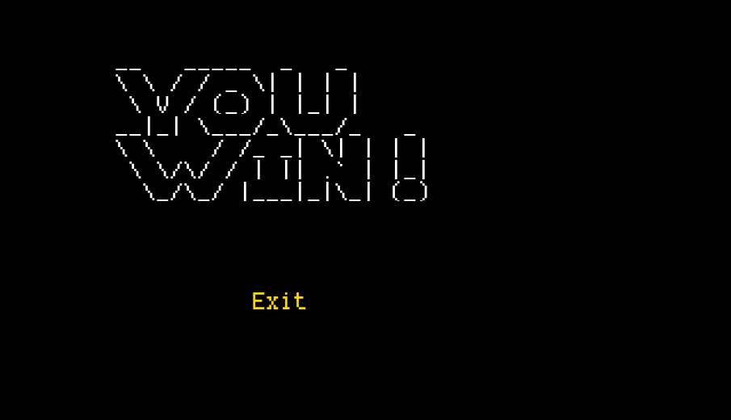

# LDTS_T06_G01 - OVERKILL

## Game Description

Our game was inspired by the classic game Bomberman, in which the protagonist uses his bombs to clear the path and destroy monsters. The version proposed by us is themed by the Steven Universe cartoon, that has Steven as a half gem boy who is a faced with a challenge to save his friends who were captured by evil gems. They were taken to a tricky maze filled with monsters and obstacles which Steven has to go through to free them. Along his path, our steven encounters new exciting power-ups to help in his mission. In each difficulty levels, he is faced with more powerfull monsters and paths.

This project was developed by Leonardo Garcia (up202200041@up.pt), Marcel Medeiros (up202200042@up.pt) and Manoela Americo (up202201392@up.pt) for LDTS 2023⁄24.

For a more detailed version of this description click [here](./docs/README.md).

## Screenshots

The following screenshots ilustrate the general look of our game, as well as the divergent functionalities:
### Game preview

  

  <b><i>Gif 1. Preview of some functionalities of the game</i></b>

 
 

### Menus

  

  <b><i>Fig 1. Main Menu </i></b>

  

 
 

  

  <b><i>Fig 2. Instructions Menu </i></b>  

  

 
 

  

  <b><i>Fig 3. Selection Level Menu </i></b>

 
 

### Levels

  

  <b><i>Fig 4. Level 1 </i></b>

 
 

  

  <b><i>Fig 5. Level 2 </i></b>

 
 

  

  <b><i>Fig 6. Level 3 </i></b>

### Animations

  

  <b><i>Gif 2. Bombs exploding</i></b>

 
 

  

  <b><i>Gif 3. 10x Bomb Upgrade </i></b>

 
 

  

  <b><i>Gif 4. Unlimited Bombs Upgrade </i></b>

  

  <b><i>Gif 5. Life Upgrade </i></b>

 
 

  

  <b><i>Gif 5. Follower Monster (strategy) </i></b>

 
 

### End Game

  

  <b><i>Fig 8. Won message</i></b>

 
 

  

  <b><i>Fig 9. Lost message</i></b>

