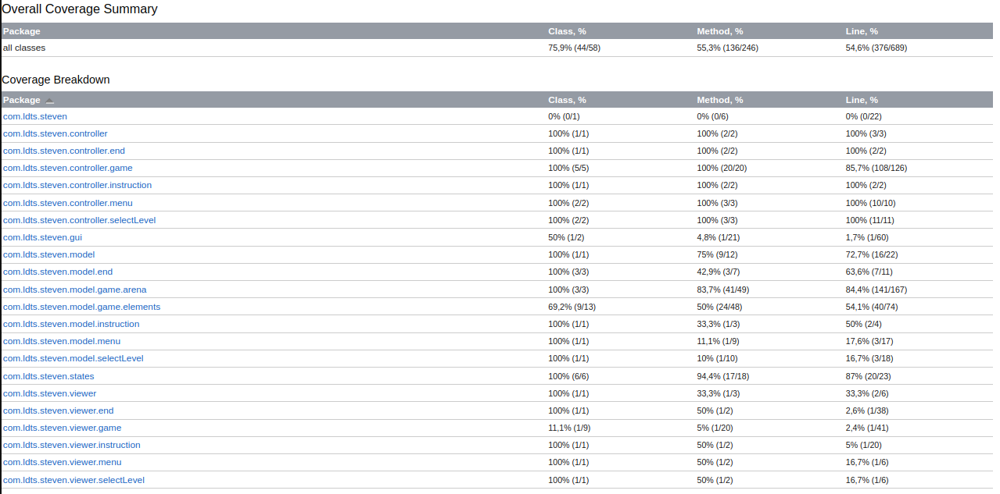

## LDTS_<10><01> - <Universe Bomber>

Our game was inspired by the classic game Bomberman, in which the protagonist uses his bombs to clear the path and destroy monsters. The version proposed by us is themed by the Steven Universe cartoon, that has Steven as a half gem boy who is a faced with a challenge to save his friends who were captured by evil gems. They were taken to a tricky maze filled with monsters and obstacles which Steven has to go through to free them. Along his path, our steven encounters new exciting power-ups to help in his mission. In each difficulty levels, he is faced with more powerfull monsters and paths. 

This project was developed by Leonardo Garcia (up202200041@up.pt), Marcel Medeiros (up202200042@up.pt) and Manoela Americo (up202201392@up.pt) for LDTS 2023⁄24.

### IMPLEMENTED FEATURES

-> **Connected Menus** : In order to play the user can go through different menus. Starting at the main menu and optionally going to the Instructions menu, or selecting 'Play' and going to the Select Level menu.

-> **Player control** : The player may move and deploy bombs with the keyboard buttons.

-> **Collisions detection** : Collisions between the elements of the game are constantly checked during play time. Elements such as monsters and Steven cannot transverse walls. However, bombs can be used to break breakable walls.

-> **Different levels** : 3 different levels with an increasing difficulty were implemented, the user can choose the level that they want to play.

-> **Monsters** : In this game Steven Universe is faced with different enemies. In each difficulty level, a monster will be presented and copies of him will be placed in the maze. A monster's objectivity is to catch Steven and damage him, making him lose his lifes. 

-> **Follower Monsters** : A type of monster that is presented in the harder levels. This monster is intelligent enough to follow Steven throughout the map. 

-> **Breakable Walls** : In each level, a different set of breakable walls is presetend in the game map. If a explosion radius of a bomb collides with this type of wall, it will break. Once broken, the user can 

-> **Deploy Bombs** : Steven (our steven) is able to deploy gem bombs. These bombs can destroy certain wall types and kill monsters. This is a default feature, which means that steven will always have this ability, however after deploying a bombing Steven has to recharge in order to deploy another one.

-> **Gain Lifes** : Steven starts the game with a maximum of 3 lifes, along his path he may lost these lifes (either by standing next to a bomb or fighiting a monster). More lifes are hidden in the walls, by exploding a wall, Steven may find those lifes and take a safer adventure. 

-> **10X Bomb Upgrade** : by finding this bomb upgrade Steven will be able to temporarily enlarge the radius of bomb damage by 10x. 

-> **Unlimited Bombs Upgrade** : by finding this bomb upgrade, Steven will be able to temporarily deploy an unlimited amount of bombs, without waiting his power to recharge.

## Planned Features

All the planned features were successfully implemented.

#### DESIGN

#### GENERAL STRUCTURE
#### PROBLEM IN CONTEXT:
The general structure of this game consists in a GUI and some different gameStates. To deal with this, we had to apply some patterns.

#### THE PATTERN:
In order to solve the problem above, the first pattern applied was the **Architectural Pattern**, we implemented de **MVC** (Model-View-Controller) design pattern that is divided in three parts: 
**Model**: Stores all the data structure of the game.
**View**: The view is responsible for presenting and rendering graphical elements in the user interface based on the state of the underlying model.
**Controller**: Controllers processes the changes and control the rules of the game.

The second state applied was the **State Pattern**, a behavioral design pattern that enables an object to alter its behavior when its internal state changes

#### THE IMLPEMENTATION:
COLOCAR IMAGEM(S)

#### CONSEQUENCES:
- The various states, indicative of different menus, are clearly defined in the code.
- The code is well-organized
- Each component has a clearly defined and focused responsibility.

#### THE GAME
#### PROBLEM CONTEXT:
Our game only have one instance, so we could use a design pattern for this.

#### THE PATTERN:
In our Game class, we used the **Singleton Pattern**. The Singleton Pattern has been employed to ensure that there is only a single instance of the class within the entire application.

#### THE IMLPEMENTATION:
COLOCAR IMAGEM(S)

#### CONSEQUENCES:
- The Game instance is globally accessible throughout the application
- We avoid unnecessary resource consumption that might occur with multiple instances.
- Maintain a consistent state across the application

#### TYPES OF MONSTERS AND BOMBS
#### PROBLEM CONTEXT:
Our game have two different types of monsters (Follower and Normal) and two types of Bombs (Upgraded and Normal).

#### THE PATTERN:
In order to solve this problem, the pattern implemented was the **Template Pattern**. We created an abstract class to Monster and two subclasses with the concrete implementations. We did the same to bombs.

#### THE IMLPEMENTATION:
COLOCAR IMAGEM(S)

#### CONSEQUENCES:
- Code reuse
- Subclasses can customize certain aspects without changing its overall structure.

### THE SCREEN STATE ####

In our game, Lanterna will be responsible to print different screens depending on the user's input. For example, once the game starts, the Menu screen will appear, after they press start the Game screen will appear. Looking at this, it's very clear that a **State Pattern** would be necessary, defining in which state the game is running, and each state is responsible for creating its viewer.

**The Pattern**

The **State Pattern** allows an object to alter its behavior. In our code, the State class is an interface that will be implemented by each Concrete State. In our main class, only the object of State class will be instaciated, because the states will differ at run-time.

**Implementation**

The following [Diagram](Docs/State.drawio.png) illustrates how the pattern was implemented.

The classes can be found at [States](src/main/java/com/ldts/steven/states)

**Consequences**

-> Transitions between states happen at run-time, and they can be explicitly found in code.

-> Ensures the **Single Responsibility Principle**

## Known-Code Smells

#### Magic Numbers
-> Identified in the Game class, when setting the FPS value. As well as in all the classes that extend the Viewer class, most specifically in the drawElements function. 

#### Duplicate Code
-> The EndViewer class uses the same logic to color the end state twice. In the case that the player wins and in the case that the player loses. Both times the same logic is duplicated, the only thing that changes is the color value.

-> The Arena class has duplicated code in the addBomb function. Four for loops are used to propagate the damage of the bomb to a xy axis. 

### UML DIAGRAM

> A UML [diagram](https://github.com/FEUP-LDTS-2023/project-l10gr01/blob/main/Docs/diagram.png) expliciting the implementation of the classes:

 

### TESTING
**TEST COVERAGE REPORT**

  

  

 
 

### SELF-EVALUATION

> The tasks of this delivery were evenly distribuited between all members. We had daily discussions about the implementation and design of our project, regarding everyone's input.

**Example**:

- Leonardo Garcia: 33%
- Marcel Medeiros: 33%
- Manoela Blanke: 33%

